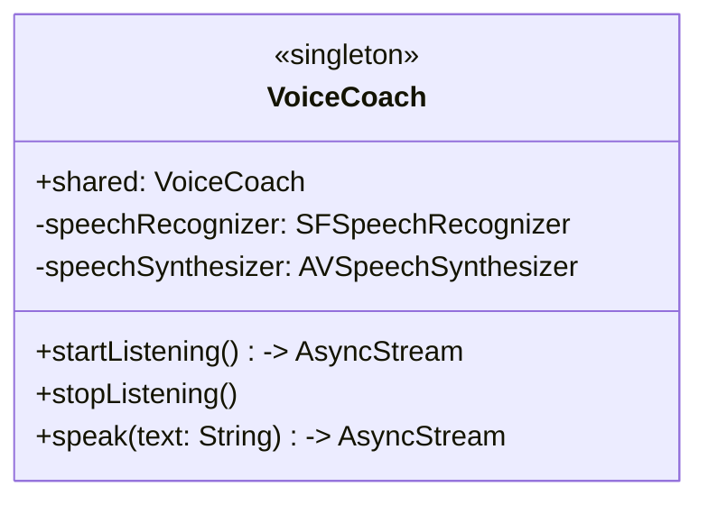

# FitVoiceCoach

**FitVoiceCoach** is a hands-free iOS app that allows users to control workout sessions using voice commands and receive audio instructions and encouragement through text-to-speech. Built with Swift and AVFoundation, this app is perfect for fitness enthusiasts who want a seamless, interactive workout experience and tech hobbyists interested in voice recognition and synthesis technology.

---

## Table of Contents
- [Overview](#overview)
- [Key Features](#key-features)
- [AVFoundation Usage](#avfoundation-usage)
- [Singleton Pattern](#singleton-pattern)
- [Enthusiast Appeal](#enthusiast-appeal)

---

## Overview

FitVoiceCoach is designed to make workouts more accessible and engaging by eliminating the need for manual interaction. Users can start, pause, resume, skip, or stop workouts using simple voice commands like "start," "pause," "next," or "stop." The app responds with audio feedback, guiding users through each exercise with instructions and motivational phrases. 

The app is built using Swift and leverages AVFoundation for speech recognition and synthesis, ensuring a smooth and responsive user experience. A Singleton pattern is used to manage the speech engine, ensuring efficient resource usage.

---

## Key Features

- **Voice Command Recognition**: Control your workout with commands like "start," "pause," "resume," "next," and "stop."
- **Audio Feedback**: Receive exercise instructions and encouragement through text-to-speech.
- **Predefined Workout Library**: Choose from three predefined workouts, each containing 3-4 exercises (e.g., push-ups, squats, plank).
- **Minimal SwiftUI Interface**: A simple, intuitive UI that displays the current exercise and workout status.
- **Local Speech Processing**: All speech recognition and synthesis are handled locally using AVFoundation, with no external APIs required.

---

## AVFoundation Usage

FitVoiceCoach uses AVFoundation to handle both speech recognition and text-to-speech:

- **Speech Recognition (SFSpeechRecognizer)**: 
  - Recognizes voice commands such as "start," "pause," "resume," "next," and "stop."
  - Configured to listen for specific commands and process them in real-time using `AsyncStream` for continuous listening.
  
- **Text-to-Speech (AVSpeechSynthesizer)**: 
  - Provides audio instructions for each exercise (e.g., "Workout started. First exercise: Push-ups").
  - Manages audio sessions to ensure smooth transitions between listening and speaking modes.

The app handles audio session configurations carefully to avoid conflicts between recognition and synthesis, ensuring a seamless user experience.

---

## Singleton Pattern

The `VoiceCoach` class is implemented as a Singleton to manage the speech engine efficiently. This ensures that only one instance of the speech recognizer and synthesizer is active at any time, preventing resource conflicts and simplifying access across the app.

### UML Diagram of VoiceCoach Singleton

- **Why a Singleton?**: Centralizes speech management, ensuring consistent state and efficient resource use.
- **Usage**: The `WorkoutViewModel` accesses the `VoiceCoach` singleton to start/stop listening for commands and to speak instructions.

---

## Enthusiast Appeal

### For Fitness Enthusiasts
- **Hands-Free Convenience**: Control your workout without touching your device—perfect for intense sessions or when your hands are busy.
- **Audio Guidance**: Stay focused with clear, spoken instructions and motivational feedback.
- **Simple Workouts**: Choose from predefined workouts like "Push-ups, Squats, Plank" for a quick, effective session.

### For Tech Hobbyists
- **Voice Technology**: Explore the integration of `SFSpeechRecognizer` and `AVSpeechSynthesizer` for real-time voice interaction.
- **Modern Swift Concurrency**: The app uses `AsyncStream` and `@MainActor` for efficient, non-blocking operations.
- **Testable Architecture**: The `VoiceCoachProtocol` and `MockVoiceCoach` enable easy unit testing of voice-related features.

---

### Additional Notes
- **Folder Structure**: The project is organized into `Models`, `Voice`, `Views`, `ViewModels`, and `Tests` for clarity.
- **Unit Tests**: Comprehensive tests for models, view models, and voice functionality are included in the `Tests` folder.
- **No External Dependencies**: The app runs entirely locally, with no need for external APIs or services.